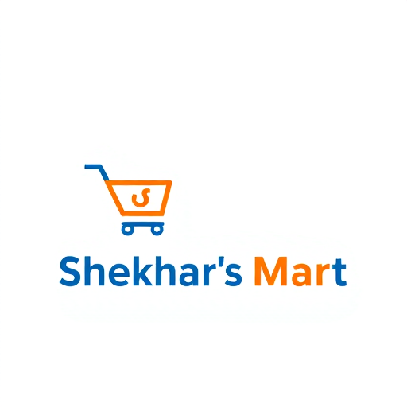
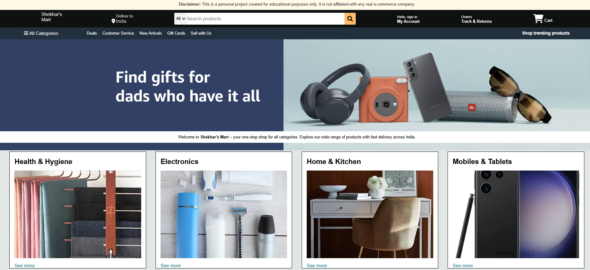

# Shekhar's Mart 🛒

[](https://github.com/Shivamshekharss/shekhars-mart) 
[](https://github.com/Shivamshekharss/shekhars-mart/commits/main)
[](https://github.com/Shivamshekharss/shekhars-mart/issues)

A **frontend clone of an e-commerce website** built for learning purposes.  
*This project is not affiliated with any real e-commerce company.*

---

## 💻 Features

- Responsive **navbar** with logo, search bar, and cart  
- Hero section with **promotional banner**  
- Product categories section with **product cards**  
- Footer with multiple **informational sections**  
- Clean and modern **CSS design**

---

## 📸 Screenshots

### Logo


### Website Screenshot


### Product Images


### Other Assets


---

## ⚙️ Installation

1. Clone the repository:

```bash
git clone https://github.com/Shivamshekharss/shekhars-mart.git
